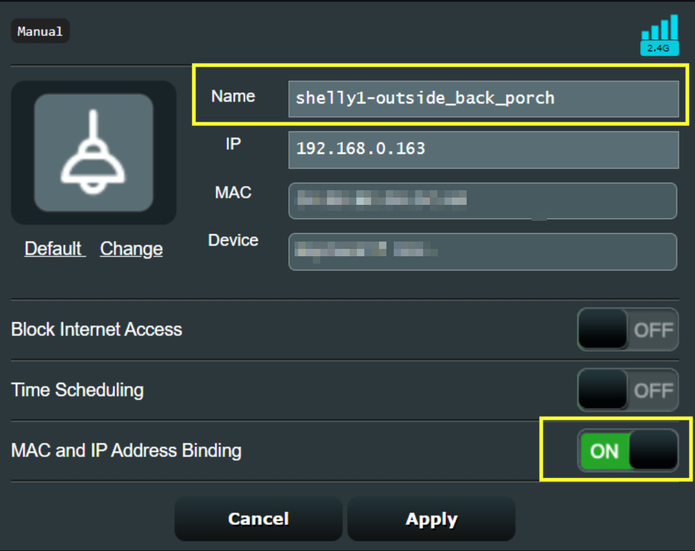

[Home](https://github.com/stheisen/homeassistant-config)
# Shelly Setup

The Shelly devices are among the easiest to configure in my home automation setup.  Just give them power, and they light up a WIFI network that hosts a small web application allowing for easy configuration to prepare the device to be added to Home Assistant (HA). As the Shelly firmware, and HA evolve overtime the following instructions are sure to become out of date.  These notes are ment to serve as a guideline for adding Shelly devices to my HA implementation and will be updated only as I run into workflow changes.

## Table of Contents
  * Shelly Devices
    * [Configuring the Shelly 1/RGBW2](#Shelly-1/RGBW2) (Updated: March 2022) 
  * [Adding Shelly Devices to HA](#Adding-Shelly-Devices-to-HA) (Updated: March 2022) 

### Shelly 1/RGBW2
The HA implelmentation instructions for the Shelly 1, and the Shelly RGBW2 are for the most part the same.  This is **NOT** a comprehensive run through of all the options a Shelly device provides.  Instead, these are merely  guidelines providing a repeatable set of actions to consistently connect Shelly devices to my HA implementation.

It is assumed when following this section that the device has been safely and properly wired and powered on.

- Once powered on, the Shelly device will provide a WIFI connection. Connect to this Shelly wifi with a mobile device.

- Open a web browser and visit [http://192.168.33.1](http://192.168.33.1) to access the Shelly web interface, and select the **Internet & Security** option.  Then expand the **WIFI MODE-CLIENT** section, and check the option to "Connect to an existing WIFI network".  

- Enter the WIFI credentials, and click "SAVE".
- A message will be displayed indicating that the Shelly device will attempt connection to the WIFI using the supplied information. There really is no success message, if refreshing the screen does not reload the web interface then that is a good indication that connection to the WIFI was a success.

- Log into the WIFI router to which this Shelly device is now connected and locate the device in the client list.  Give this newly added Shelly device a meaningful name, document its assigned IP address, and take the steps necessary for your router to set the provided IP address as static.  (An ASUS RT-AX86U running Asuswrt-Merlin is used in the example)

- Using that static IP address, revist the Shelly web interface in a web browser on the same network to complete the Shelly configuration. In this example, by visiting http://192.168.0.163 I am greeted with the same (insecure - we'll fix that in a moment) web interface used in step 3 above.

- Select select the **Internet & Security** option, and expand the **RESTRICT LOGIN** lection.  Check the option to Restrict the web interface with a "Username" and "Password", provide the desired information and hit save.

- The Shelly web interface reloads, prompting for the entry of the configured username and password.  Enter that information to re-gain access to the Shelly web interface.
- Home Assistant does NOT need the Shelly connected to the cloud, to make sure this is disabled again under **Internet & Security**  expand the **CLOUD** section and check that it is set to disabled. This setting can also be quickly validated by the cloud icon at the top of interface. The cloud icon should appear in red when diabled.

- Click on the **Settings** option, and expand the **FIRMWARE UPDATE** section.  Before HA can use the Shelly device it is likely that the firmware will need updated.  This is a relativly simple process, select **UPDATE FIRWARE** confirm the message at the top of the screen, and wait a couple of minutes for the interface to reload.

- It is certianly a good practice to verifity the powermode the device will follow when restoring from a power outage. Click on the **Settings** option, and expand the **POWER ON DEFAULT MODE** section to choose the appropriate behavior for the application.

- Finally, validate the behavior of an attached physical switch by clicking on the **Settings** option, and expanding the **BUTTON TYPE** section. Choose the appropriate behavior for the physical switch connected to the Shelly.

### Adding Shelly Devices to HA
*NOTE: This section expects the user to have a high level of familiarty with HA, and therefore screenshots for adding Shelly devices to HA are not provided*

Mostly for stability reasons, all of my Shelly devices are added to HA using the core functionality supplied and follow this simple workflow.

- In the HA configuration section, navigate to **Integrations**
- At the bottom right click **+ ADD INTEGRATION**
- Search for and click the option for "Shelly"
- Either select the discoverd Shelly device, or enter the assigned static IP Address of the new device and click **SUBMIT**
- Enter the credentials used to lockdown the Shelly web interface
- (Optionally) select an Area to associate this new device to and click **FINISH**
- Navigate to the Shelly integration card, and select the newly added device
- Provide a meaningful name for the device by clicking the Pencil icon at the top of the interface, click **UPDATE** and then **APPLY**
- Return to the **Integration** screen, navigate to the Shelly integration card, and select the newly added device
- Select the "# entities" option to access the list of entities this device provides

- In the list of entities for this device, make sure to enable:
  - firmware_update - Provides the ability to trigger and automation for available firware updates
  - rssi - Provides the ability to trigger and automation for a weak WIFI signal
- This device is ready to automate!

