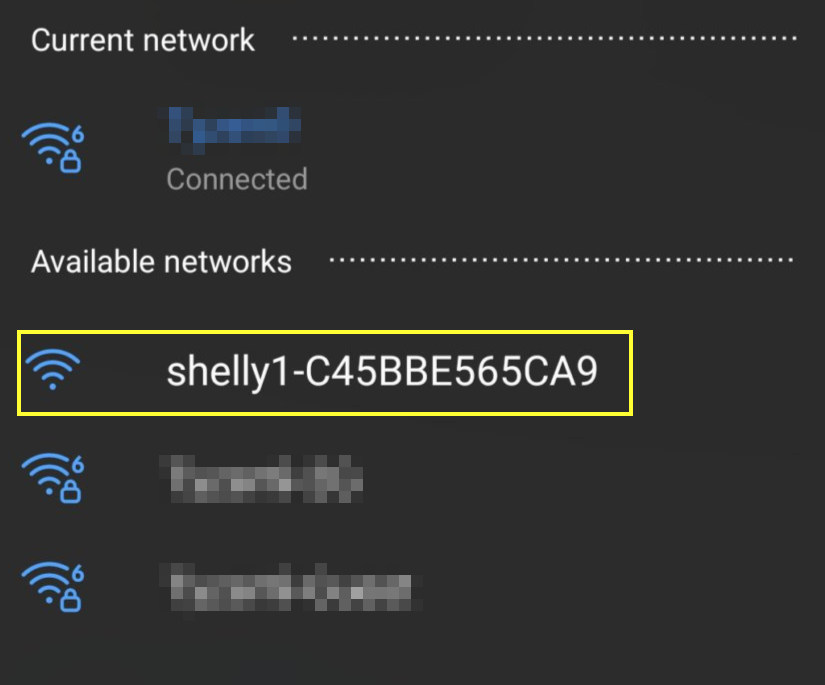

Home](https://github.com/stheisen/homeassistant-config)
# Shelly Setup

## Table of Contents
  * [HACS](#HACS)
    * [Alexa Media Player](#Alexa-Media-Player)

### Shelly 1
1. Wire the device as per the instructions
2. Once powered on connect to the shelly wifi with a mobile device

3. Open your web browser and visit [http://192.168.33.1](http://192.168.33.1)
